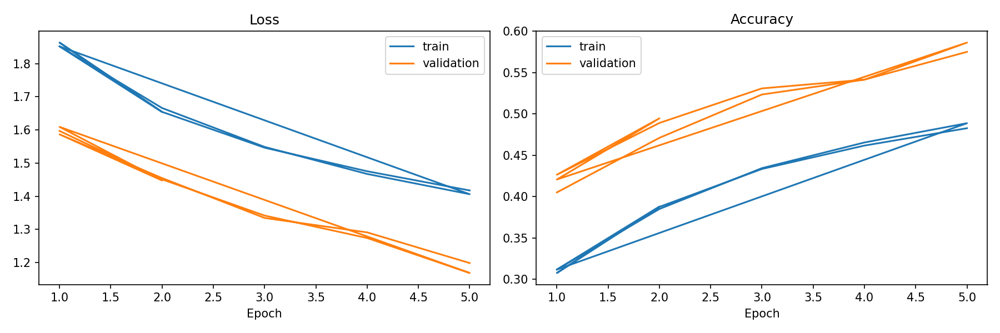
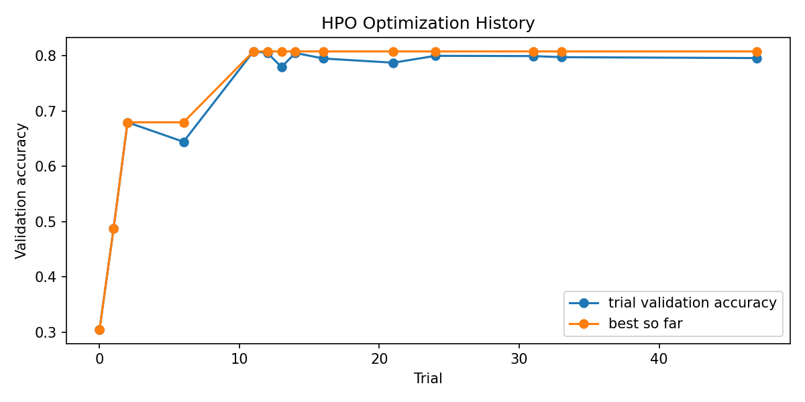
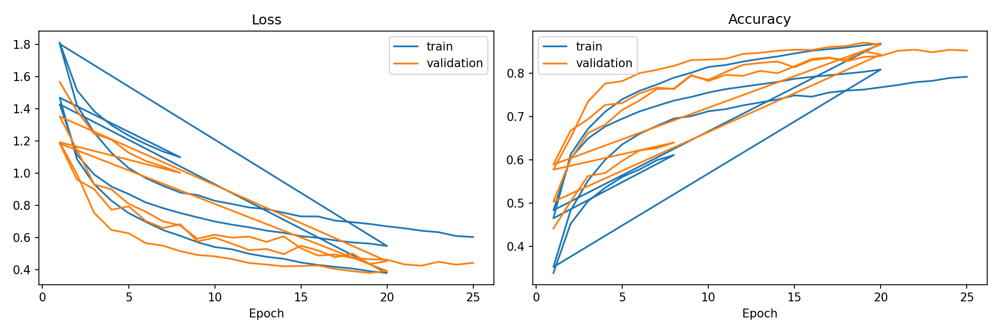
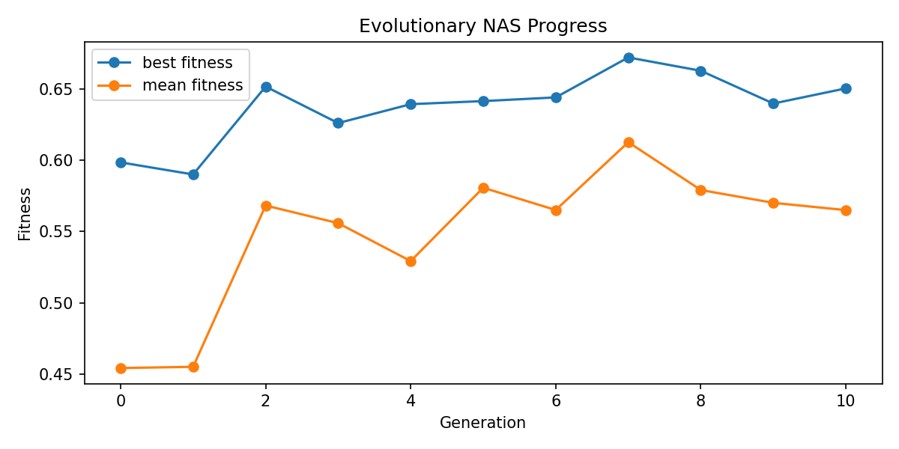
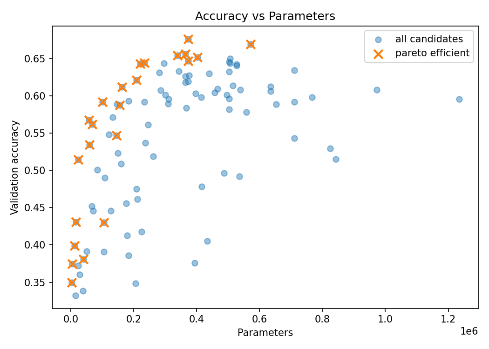
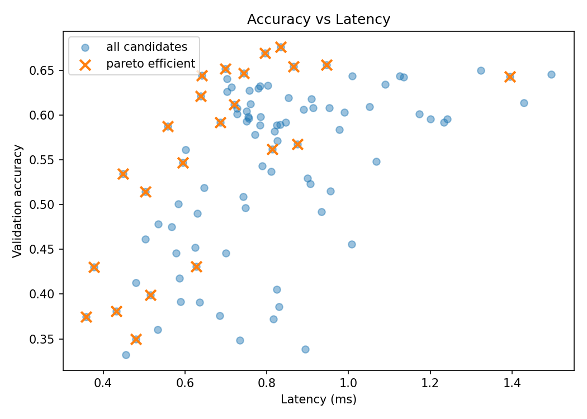
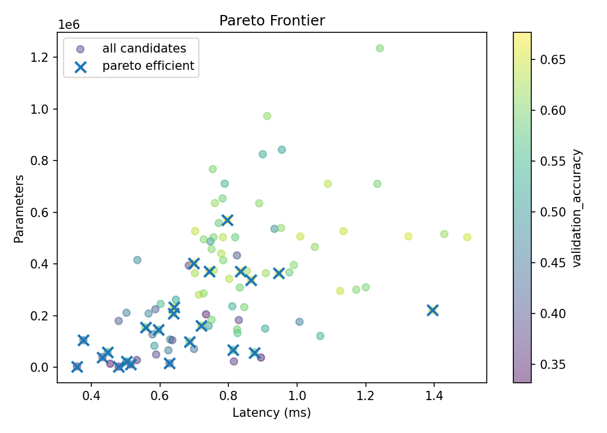
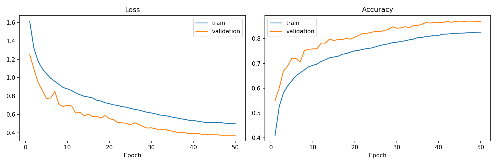
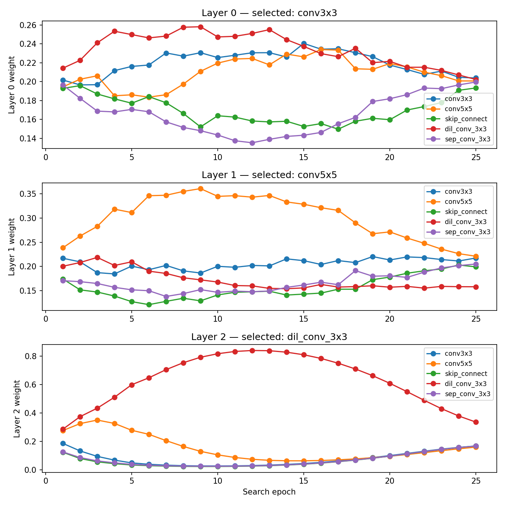
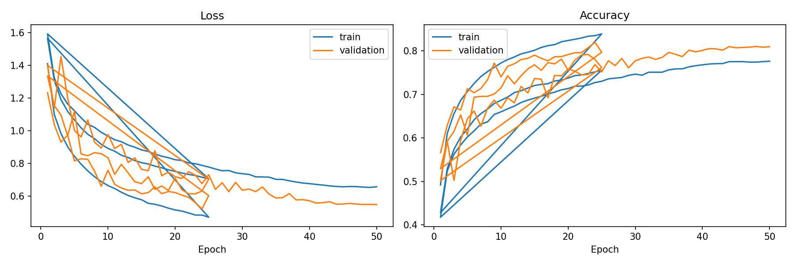

# GGSN Project — Full Code Documentation

## Table of Contents

1. [Overview](#1-overview)
2. [Data Pipeline](#2-data-pipeline)
3. [Training System](#3-training-system)
4. [Evaluation](#4-evaluation)
5. [Utilities](#5-utilities)
6. [Baseline CNN](#6-baseline-cnn)
   - [Architecture](#61-architecture)
   - [Configuration](#62-configuration)
   - [Training Dynamics](#63-training-dynamics)
   - [Results](#64-results)
7. [Hyperparameter Optimization (HPO)](#7-hyperparameter-optimization-hpo)
   - [Search Algorithm](#71-search-algorithm)
   - [Search Space & Configuration](#72-search-space--configuration)
   - [Optimization Process](#73-optimization-process)
   - [Best Configuration](#74-best-configuration)
   - [Results & Delta from Baseline](#75-results--delta-from-baseline)
8. [Evolutionary NAS](#8-evolutionary-nas)
   - [Search Algorithm](#81-search-algorithm)
   - [Search Space & Configuration](#82-search-space--configuration)
   - [Evolution Process](#83-evolution-process)
   - [Best Genome](#84-best-genome)
   - [Pareto Frontier](#85-pareto-frontier)
   - [Results & Delta from Baseline](#86-results--delta-from-baseline)
9. [DARTS Differentiable Search](#9-darts-differentiable-search)
   - [Search Algorithm](#91-search-algorithm)
   - [Configuration](#92-configuration)
   - [Architecture Weight Convergence](#93-architecture-weight-convergence)
   - [Derived Genome](#94-derived-genome)
   - [Results & Comparisons](#95-results--comparisons)
10. [Cross-Method Comparison](#10-cross-method-comparison)
    - [Comparison Table](#101-comparison-table)
    - [Plot Verification](#102-plot-verification)
    - [Key Takeaways](#103-key-takeaways)
11. [Configuration Reference](#11-configuration-reference)
12. [CLI Entrypoints & How to Run](#12-cli-entrypoints--how-to-run)

---

## 1. Overview

**Goal:** Build a research-oriented framework for Hyperparameter Optimization (HPO), Evolutionary Neural Architecture Search (NAS), and DARTS-inspired differentiable search on CIFAR-10. Optimize for accuracy, model size, and inference latency.

**Dataset:** CIFAR-10 (10 classes, 32×32 RGB, 50k train / 10k test). Training set further split 90/10 into train and validation.

**Hardware:** All experiments run on Tesla T4 GPU (Google Colab).

**Pipeline:**
```
Baseline CNN → HPO (Optuna) → Evolutionary NAS → DARTS
                                  ↓
                         Hardware-Aware Fitness
                                  ↓
                           Pareto Analysis
```

Each search method trains candidates with **reduced epochs**, then **retrains the best architecture from scratch** with a full schedule for final evaluation.

---

## 2. Data Pipeline

### 2.1 Transforms

**File:** `data/transforms.py`

CIFAR-10 normalization constants:

```
CIFAR10_MEAN = (0.4914, 0.4822, 0.4465)
CIFAR10_STD  = (0.2470, 0.2435, 0.2616)
```

#### `get_train_transforms(random_crop=True, random_horizontal_flip=True) -> Compose`

Returns training augmentation pipeline: RandomCrop(32, padding=4) → RandomHorizontalFlip → ToTensor → Normalize.

#### `get_eval_transforms() -> Compose`

Returns deterministic evaluation pipeline: ToTensor → Normalize (no augmentation).

---

### 2.2 Dataloader

**File:** `data/dataloader.py`

#### `get_cifar10_datasets(data_dir, validation_ratio, seed, download) -> (train_dataset, validation_dataset, test_dataset)`

Downloads CIFAR-10 (if needed), splits the 50k training images into train/validation, returns three datasets. Only the training set receives augmentation.

#### `get_cifar10_dataloaders(data_dir, batch_size, validation_ratio, num_workers, seed, download, pin_memory) -> (train_loader, validation_loader, test_loader)`

Returns three DataLoaders. When CUDA is available, `pin_memory=True` by default.

**Parameters:**

| Parameter | Type | Default | Description |
|---|---|---|---|
| `data_dir` | `str | Path` | `"data/raw"` | Where CIFAR-10 is stored |
| `batch_size` | `int` | `64` | Batch size for all loaders |
| `validation_ratio` | `float` | `0.1` | Fraction of training set to hold out for validation |
| `num_workers` | `int` | `2` | Dataloader workers |
| `seed` | `int` | `42` | Seed for deterministic train/val split |
| `download` | `bool` | `True` | Download CIFAR-10 if missing |
| `pin_memory` | `bool | None` | `None` (auto: True if CUDA) |

---

## 3. Training System

**File:** `training/trainer.py`

### `class EpochResult`

Dataclass: `epoch`, `train_loss`, `train_accuracy`, `validation_loss`, `validation_accuracy`, `epoch_time_seconds`.

### `class TrainingResult`

Dataclass: `history` (list of EpochResult), `best_validation_accuracy`, `best_checkpoint_path`.

### `class EarlyStopping`

Tracks validation accuracy and stops training when no improvement for `patience` epochs.

**Parameters:** `patience` (5), `min_delta` (0.0).

**Method:** `step(score) → bool` — returns `True` when training should stop.

### `get_default_device() -> torch.device`

Returns `cuda` when available, otherwise `cpu`.

### `train_one_epoch(model, dataloader, criterion, optimizer, device, scaler, use_mixed_precision) -> EvaluationResult`

Runs a single training epoch with tqdm progress bar. Returns average loss and accuracy. Supports mixed precision (`torch.amp.GradScaler` + `autocast`).

### `save_checkpoint(path, model, optimizer, epoch, validation_accuracy) -> None`

Saves model state dict, optimizer state dict, epoch, and validation accuracy.

### `load_checkpoint(path, model, optimizer, device) -> dict`

Loads a checkpoint into a model (and optionally optimizer). Returns the checkpoint dict.

### `append_epoch_to_csv(path, result) -> None`

Appends one `EpochResult` row to a CSV log file. Creates the file with header on first write.

### `fit(model, train_loader, validation_loader, criterion, optimizer, epochs, device, use_mixed_precision, early_stopping_patience, checkpoint_path, log_csv_path) -> TrainingResult`

Full training loop:

1. Creates GradScaler and EarlyStopping.
2. For each epoch: train → validate → log → checkpoint if improved → early-stop check.
3. Returns the `TrainingResult`.

**Parameters:**

| Parameter | Type | Default | Description |
|---|---|---|---|
| `model` | `nn.Module` | — | Model to train |
| `train_loader` | `DataLoader` | — | Training data |
| `validation_loader` | `DataLoader` | — | Validation data |
| `criterion` | `nn.Module` | — | Loss function |
| `optimizer` | `Optimizer` | — | Optimizer |
| `epochs` | `int` | — | Max epochs |
| `device` | `torch.device | None` | `None` | Auto-detected if None |
| `use_mixed_precision` | `bool` | `True` | Enable AMP |
| `early_stopping_patience` | `int | None` | `5` | Patience or None to disable |
| `checkpoint_path` | `str | Path | None` | `"checkpoints/best_model.pt"` |
| `log_csv_path` | `str | Path | None` | `"results/training_log.csv"` |

---

## 4. Evaluation

### 4.1 Metrics

**File:** `evaluation/metrics.py`

#### `class EvaluationResult`

Dataclass: `loss` (float), `accuracy` (float).

#### `accuracy_from_logits(logits, targets) -> float`

Returns batch accuracy in [0, 1].

#### `count_parameters(model, trainable_only=True) -> int`

Counts model parameters. When `trainable_only=True`, only `requires_grad=True` params are counted.

#### `evaluate(model, dataloader, criterion, device) -> EvaluationResult`

Evaluates loss and accuracy over a full dataloader with `torch.inference_mode()`.

---

### 4.2 Latency

**File:** `evaluation/latency.py`

#### `measure_inference_latency(model, input_shape, device, warmup_steps, measured_steps) -> float`

Measures average forward-pass inference latency in milliseconds.

**Parameters:**

| Parameter | Type | Default | Description |
|---|---|---|---|
| `model` | `nn.Module` | — | Model to benchmark |
| `input_shape` | `tuple` | `(1, 3, 32, 32)` | Random input tensor shape |
| `device` | `torch.device | None` | `None` | Uses model's device if None |
| `warmup_steps` | `int` | `20` | Warmup passes before timing |
| `measured_steps` | `int` | `100` | Timed passes for averaging |

Synchronizes CUDA before/after timing when running on GPU.

---

### 4.3 Pareto

**File:** `evaluation/pareto.py`

#### `compute_pareto_frontier(results, accuracy_column, parameter_column, latency_column) -> DataFrame`

Returns non-dominated rows from a search results DataFrame. A point is Pareto-efficient if no other point has strictly better accuracy AND lower latency AND lower parameters.

#### `save_pareto_frontier(results_csv_path, output_csv_path, ...) -> DataFrame`

Loads CSV, computes Pareto frontier, saves to output CSV.

#### `plot_accuracy_vs_latency(results, pareto, output_path, ...) -> None`

Scatter plot with accuracy on Y, latency on X, Pareto points highlighted.

#### `plot_accuracy_vs_parameters(results, pareto, output_path, ...) -> None`

Scatter plot with accuracy on Y, parameters on X, Pareto points highlighted.

#### `plot_pareto_frontier(results, pareto, output_path, ...) -> None`

Scatter plot with parameters on Y, latency on X, colored by accuracy. Pareto points highlighted.

#### `plot_pareto_analysis(results_csv_path, pareto_csv_path, accuracy_latency_path, accuracy_parameters_path, pareto_frontier_path) -> DataFrame`

Runs the full Pareto pipeline: load CSV → compute Pareto → save frontier → save all three trade-off plots.

---

## 5. Utilities

### 5.1 Config

**File:** `utils/config.py`

#### `load_yaml_config(path) -> dict`

Loads a YAML config file into a dictionary.

---

### 5.2 Plotting

**File:** `utils/plotting.py`

#### `plot_training_curves(log_csv_path, output_path) -> None`

Dual-panel plot: Loss (train + validation) and Accuracy (train + validation) across epochs. Reads from the CSV log produced by `fit()`.

---

### 5.3 Reproducibility

**File:** `utils/reproducibility.py`

#### `set_seed(seed) -> None`

Seeds Python's `random`, NumPy, PyTorch, and CUDA random number generators for deterministic runs.

---

## 6. Baseline CNN

The manually-designed baseline CNN serves as the reference point. All optimization methods should improve over this.

### 6.1 Architecture

**File:** `models/baseline_cnn.py`

A configurable CNN. Each layer: **Conv2d → BatchNorm → ReLU → MaxPool2d → Dropout2d**. Followed by **AdaptiveAvgPool → Flatten → Linear** classifier.

#### `class BaselineCNN(nn.Module)`

**Parameters:**

| Parameter | Type | Default | Description |
|---|---|---|---|
| `num_classes` | `int` | `10` | Number of output classes |
| `input_channels` | `int` | `3` | Number of input channels (RGB) |
| `filters` | `Sequence[int]` | `(32, 64, 128)` | Output channels per layer |
| `kernel_sizes` | `int | Sequence[int]` | `3` | Kernel size per layer (broadcast if scalar) |
| `dropout` | `float` | `0.2` | Dropout rate for Dropout2d |
| `use_batch_norm` | `bool` | `True` | Whether to add BatchNorm after each Conv2d |

**Forward:** `(B, 3, 32, 32) → (B, 10)`

#### `build_baseline_cnn(num_layers, base_filters, filter_multiplier, kernel_size, dropout, num_classes) -> BaselineCNN`

Convenience factory that expands scalar params into the per-layer format.

**Parameters:**

| Parameter | Type | Default | Description |
|---|---|---|---|
| `num_layers` | `int` | `3` | Number of conv layers |
| `base_filters` | `int` | `32` | Base filter count for layer 0 |
| `filter_multiplier` | `int` | `2` | Doubled each layer: `filters[i] = base_filters × multiplier^i` |
| `kernel_size` | `int` | `3` | Kernel size for all layers |
| `dropout` | `float` | `0.2` | Dropout rate |
| `num_classes` | `int` | `10` | Number of output classes |

---

### 6.2 Configuration

**File:** `experiments/baseline_cnn.yaml`

| Parameter | Value |
|---|---|---|
| Layers | 3 |
| Filters | [32, 64, 128] (base=32, multiplier=2) |
| Kernel size | 3 |
| Dropout | 0.1 |
| Optimizer | Adam (lr=0.001) |
| Epochs | 100 (early stopping patience=10) |
| Batch size | 64 |
| Weight decay | 0.0005 |
| Mixed precision | Yes |
| Cosine scheduler | Yes |

---

### 6.3 Training Dynamics

**Training curves:** `plots/baseline_training_curves.png`

With only **94K parameters**, the baseline trains quickly but has limited capacity:

| Phase | Epochs | Train loss | Val loss | Val accuracy |
|---|---|---|---|---|
| Warm-up | 1–3 | ~1.8 → 1.0 | ~1.6 → 1.0 | ~30% → 50% |
| Learning | 4–15 | ~1.0 → 0.6 | ~1.0 → 0.9 | ~50% → 65% |
| Plateau | 16–20 | ~0.6 | ~0.9 | **~68–70%** |

The gap between train and val accuracy is small (~2–3 pp), indicating **underfitting** rather than overfitting — there is capacity left on the table.

**What to expect:** The baseline will not reach state-of-the-art CIFAR-10 performance (~93%+). It is intentionally simple to serve as a lower bound.



---

### 6.4 Results

| Metric | Value |
|---|---|
| Test accuracy | **67.81%** |
| Test loss | 0.9109 |
| Parameters | **94,762** |
| Latency (ms) | **0.61** |
| Epochs trained | 20 (early stopped) |

> **Comment:** 67.81% is reasonable for a lightweight 94K-param CNN but well below what's achievable. The low capacity means the model underfits — substantial room for improvement through hyperparameter tuning and architectural search.

---

## 7. Hyperparameter Optimization (HPO)

Uses Optuna to automate tuning of CNN hyperparameters.

### 7.1 Search Algorithm

**File:** `hpo/optuna_search.py`

#### `suggest_hyperparameters(trial, config) -> dict`

Samples one hyperparameter configuration from the YAML-defined search space using Optuna's `suggest_*` API.

Search space: learning_rate (log-uniform), batch_size (categorical), optimizer (categorical: adam/sgd), dropout (uniform), base_filters (categorical), num_layers (int), weight_decay (log-uniform).

#### `build_optimizer(model, optimizer_name, learning_rate, weight_decay) -> Optimizer`

Creates Adam or SGD optimizer. Used across all experiments.

| `optimizer_name` | Optimizer | Notes |
|---|---|---|
| `"adam"` | `torch.optim.Adam` | — |
| `"sgd"` | `torch.optim.SGD` | momentum=0.9 |

#### `create_pruner(config) -> BasePruner`

Creates Optuna pruner: `"median"` (MedianPruner) or `"none"` (NopPruner).

#### `create_objective(config) -> callable`

Returns an Optuna objective function that builds a model from sampled hyperparameters, trains for `trial_epochs` epochs, and returns the best validation accuracy. Supports pruning via `trial.report()` / `trial.should_prune()`.

#### `plot_optimization_history(study, output_path) -> None`

Plots per-trial validation accuracy with best-so-far overlay.

#### `save_study_outputs(study, config) -> None`

Saves trials CSV, best params JSON, and optimization history plot.

#### `train_best_model(config, best_params) -> dict`

Retrains the best HPO configuration from scratch with `final_epochs`, evaluates on the test set, measures latency, plots training curves. Returns a summary dict.

#### `run_hpo(config) -> dict`

Main entry point:

1. Create Optuna study with pruner.
2. Run optimization for `n_trials`.
3. Save study outputs.
4. Retrain best model.
5. Compare with baseline.
6. Save summary to JSON.

**Output files:**

| File | Contents |
|---|---|
| `results/hpo_trials.csv` | All trial hyperparameters and results |
| `results/hpo_best_params.json` | Best hyperparameter configuration |
| `results/hpo_summary.json` | Full experiment summary |
| `results/hpo_best_training_log.csv` | Per-epoch log of retrained best model |
| `plots/hpo_optimization_history.png` | Trial accuracy over time |
| `plots/hpo_best_training_curves.png` | Retrained model training curves |
| `checkpoints/hpo_best_baseline_cnn.pt` | Best model checkpoint |

---

### 7.2 Search Space & Configuration

**File:** `experiments/hpo_baseline.yaml`

| Hyperparameter | Search range | Best value found |
|---|---|---|
| Learning rate | [1e-4, 1e-2] (log) | **0.00440** |
| Batch size | [64, 128] | **128** |
| Optimizer | [adam, sgd] | **adam** |
| Dropout | [0.0, 0.5] | **0.157** |
| Base filters | [16, 32, 64, 128] | **128** |
| Num layers | [2, 4] | **4** |
| Weight decay | [1e-5, 1e-3] (log) | **1.22e-5** |

**Search config:** 50 trials, MedianPruner (n_startup=3, n_warmup=1), 10 trial epochs, 50 final retrain epochs.

---

### 7.3 Optimization Process

**Optimization history:** `plots/hpo_optimization_history.png`

| Phase | Trials | Observation |
|---|---|---|
| Exploration | 0–10 | Wide variance (0.35–0.65 val acc) as sampler explores |
| Convergence | 11–30 | Adam + 4 layers + 128 base filters emerges as dominant pattern |
| Refinement | 31–49 | Cluster tightens around 0.75–0.80 val acc |
| Best trial | 11 | Peaks at **0.8076** val acc |

The MedianPruner terminated 22 of 50 trials early. Deeper networks with higher base filters consistently outperformed smaller architectures. The optimal learning rate (0.0044) is higher than the baseline's 0.001.

**What to expect:** Convergence within 10–15 trials. The most important hyperparameter is **base_filters=128** — wider networks consistently outperform. **num_layers=4** is also critical (2–3 layer variants are pruned early). Adam strongly outperforms SGD.



---

### 7.4 Best Configuration

| Hyperparameter | Value |
|---|---|---|
| Learning rate | 0.00440 |
| Batch size | 128 |
| Optimizer | adam |
| Dropout | 0.157 |
| Base filters | 128 |
| Num layers | 4 |
| Weight decay | 1.22e-5 |

**Architecture:** 4 conv layers with filters [128, 256, 512, 1024], kernel_size=3, moderate dropout (0.157), max pooling after each layer. The optimal weight decay is near-zero, and a higher learning rate (0.0044) accelerates convergence for this larger model.

---

### 7.5 Results & Delta from Baseline

**Best model training curves:** `plots/hpo_best_training_curves.png`

| Metric | Value |
|---|---|
| Best trial val accuracy (search) | **80.76%** |
| Test accuracy (retrained) | **85.07%** |
| Test loss | 0.4572 |
| Parameters | **6,210,698** |
| Latency (ms) | **1.06** |

**Delta from baseline:**

| Metric | Baseline | HPO | Δ |
|---|---|---|---|
| Test accuracy | 67.81% | **85.07%** | **+17.26 pp** |
| Parameters | 94,762 | 6,210,698 | +6,115,936 |
| Latency (ms) | 0.61 | 1.06 | +0.45 |

> **Comment:** HPO provides the largest accuracy gain (+17.26 pp). The best configuration is a deep (4-layer) and wide (128 base filters — doubled each layer → [128, 256, 512, 1024]) network with moderate dropout (0.157) — unlike the baseline, this large-capacity model *benefits* from dropout regularization. The optimal learning rate (0.0044) is higher than the baseline's 0.001, since the larger network needs stronger gradients. All top trials used **Adam** and **batch_size=128**. The model has 6.2M parameters — 65× more than the baseline — which explains the higher latency (1.06 ms vs 0.61 ms). This is the most computationally expensive but most accurate configuration found.



---

## 8. Evolutionary NAS

Implements an evolutionary algorithm with regularized aging for CNN architecture search, with hardware-aware multi-objective fitness.

### 8.1 Search Algorithm

#### Genome Format

**File:** `nas/mutation.py`

All architectures are represented as a genome dictionary:

```python
{
    "num_layers": int,
    "filters": list[int],
    "kernel_sizes": list[int],
    "pooling_types": list[str],     # "max" or "avg"
    "skip_connections": list[bool],  # residual connections
    "dropout": float,
}
```

#### Mutation (`nas/mutation.py`)

| Function | Description |
|---|---|
| `random_genome(search_space, rng)` | Generates a random genome uniformly sampled from the search space |
| `normalize_genome_layers(genome, search_space, rng)` | Ensures per-layer fields match `num_layers` (truncates or pads with random values) |
| `mutate_genome(genome, search_space, rng, mutation_rate)` | Per-field mutations with probability `mutation_rate`. Can grow/shrink the network |

#### Selection (`nas/selection.py`)

| Function | Description |
|---|---|
| `select_elite(population, elite_size)` | Returns top `elite_size` individuals by fitness |
| `tournament_selection(population, tournament_size, rng)` | Randomly samples `tournament_size` individuals, returns the fittest |

#### Fitness (`nas/fitness.py`)

| Function | Formula |
|---|---|
| `accuracy_fitness(accuracy)` | `Fitness = accuracy` |
| `hardware_aware_fitness(accuracy, params, latency, α, β, param_scale, latency_scale)` | `Fitness = accuracy − α·(params/param_scale) − β·(latency/latency_scale)` |

#### SearchCNN — Model used by evolved architectures

**File:** `models/search_cnn.py`

##### `class SearchConvBlock(nn.Module)`

One convolutional block with optional residual skip and configurable pooling type.

**Parameters:** `in_channels`, `out_channels`, `kernel_size` (3 or 5), `pooling_type` ("max"/"avg"), `use_skip` (bool), `dropout`.

**Forward:** `(B, C_in, H, W) → conv → bn → relu → (+residual if skip) → pool → dropout → (B, C_out, H/2, W/2)`

##### `class SearchCNN(nn.Module)`

**Parameters:** `filters`, `kernel_sizes`, `pooling_types`, `skip_connections`, `dropout`, `num_classes` (10), `input_channels` (3).

All per-layer sequences must have the same length.

**Forward:** `(B, 3, 32, 32) → (B, 10)`

##### `build_search_cnn_from_genome(genome, num_classes=10) -> SearchCNN`

Builds a SearchCNN from a serializable genome dictionary.

#### Evolutionary Search Loop (`nas/evolutionary_search.py`)

##### `class EvaluatedIndividual`

Dataclass: `generation`, `individual_id`, `genome`, `fitness`, `validation_accuracy`, `train_accuracy`, `train_loss`, `validation_loss`, `parameters`, `latency_ms`, `parameter_penalty`, `latency_penalty`.

##### `evaluate_genome(genome, individual_id, generation, config, train_loader, validation_loader) -> EvaluatedIndividual`

Trains one candidate for `candidate_epochs` epochs and returns its evaluated metrics.

##### `run_evolutionary_search(config) -> dict`

Main entry point:

1. Create initial population of `population_size`. Evaluate all.
2. For each generation (up to `generations`):
   - `tournament_selection` to pick a parent.
   - `mutate_genome` the parent to create a child.
   - `evaluate_genome` the child.
   - Add child to active population, remove oldest (regularized evolution / aging).
3. Save best genome, plot evolution, run Pareto analysis, retrain best architecture.

**Config keys:**

| Key | Description |
|---|---|
| `search.population_size` | Number of individuals in initial population |
| `search.generations` | Number of generations |
| `search.children_per_generation` | Children created per generation |
| `search.candidate_epochs` | Training epochs per candidate during search |
| `search.tournament_size` | Tournament size for parent selection |
| `search.mutation_rate` | Per-field mutation probability |
| `search.fitness_mode` | `"accuracy"` or `"hardware_aware"` |
| `hardware_aware.alpha` | Parameter penalty coefficient |
| `hardware_aware.beta` | Latency penalty coefficient |

**Output files:**

| File | Contents |
|---|---|
| `results/evolutionary_population.csv` | All evaluated individuals across generations |
| `results/evolutionary_best_genome.json` | Best genome found |
| `results/evolutionary_summary.json` | Full experiment summary |
| `results/evolutionary_best_training_log.csv` | Per-epoch log of retrained best model |
| `results/evolutionary_pareto_frontier.csv` | Pareto-optimal individuals |
| `plots/evolutionary_progress.png` | Best/mean fitness per generation |
| `plots/evolutionary_best_training_curves.png` | Retrained best model curves |
| `plots/evolutionary_accuracy_vs_latency.png` | Accuracy-latency trade-off |
| `plots/evolutionary_accuracy_vs_parameters.png` | Accuracy-parameters trade-off |
| `plots/evolutionary_pareto_frontier.png` | Combined Pareto plot |
| `checkpoints/evolutionary_best_cnn.pt` | Best model checkpoint |

---

### 8.2 Search Space & Configuration

**File:** `experiments/evolutionary_nas.yaml`

| Parameter | Value / Range |
|---|---|---|
| Population size | 16 |
| Generations | 10 |
| Children per generation | 8 |
| Total evaluated | 96 |
| Candidate epochs | 3 |
| Tournament size | 4 |
| Mutation rate | 0.3 |
| Crossover rate | 0.2 |
| Fitness mode | `hardware_aware` |
| α (param penalty) | 0.01 |
| β (latency penalty) | 0.001 |
| Batch size | 128 |
| Final retrain epochs | 50 |

**Search space:**

| Dimension | Range / Choices |
|---|---|
| Num layers | [2, 4] |
| Filters per layer | [16, 32, 64, 128] |
| Kernel sizes | [3, 5] |
| Pooling types | [max, avg] |
| Skip connections | [false, true] |
| Dropout | [0.0, 0.5] |

---

### 8.3 Evolution Process

**Evolution progress:** `plots/evolutionary_progress.png`

| Generation | Mean fitness | Best fitness | Observation |
|---|---|---|---|
| 0 | ~0.42 | 0.591 | Random architectures, high variance (0.30–0.60) |
| 1 | ~0.49 | 0.607 | Poor architectures淘汰ed quickly |
| 2 | ~0.55 | 0.616 | 4-layer designs dominate |
| 3 | ~0.58 | **0.643** | Skip connections become common |
| 4 | ~0.57 | 0.629 | Fitness gains slow (diminishing returns) |
| 5 | ~0.59 | 0.654 | [128,128,128,128] filter pattern emerges |
| 6 | ~0.62 | **0.655** | Best individual found (#43) |
| 7 | ~0.58 | 0.636 | Plateau — population converged |
| 8 | ~0.60 | 0.641 | No improvement over generation 6 |

All top individuals converge to a common structure: **4 layers**, filters ending in `[128, 128]`, kernel sizes mixing 3 and 5, a skip connection in the deepest layer, and near-zero dropout.

The hardware-aware penalty (α=0.01, β=0.001) is subtle — ~0.008 for a 710K-param model vs. raw accuracy of ~0.66. Accuracy dominates the fitness, so the search favors larger models.



---

### 8.4 Best Genome

**Individual #43, Generation 6** — saved in `results/evolutionary_best_genome.json`

```json
{
  "num_layers": 4,
  "filters": [128, 128, 128, 128],
  "kernel_sizes": [3, 3, 5, 3],
  "pooling_types": ["max", "max", "max", "avg"],
  "skip_connections": [false, false, false, true],
  "dropout": 0.005
}
```

**Architecture:** 4 conv layers, all with 128 filters. First two layers use 3×3 kernels and max pooling. Third layer uses 5×5 kernel and max pooling. Fourth layer uses 3×3 kernel and average pooling with a skip connection. Near-zero dropout.

---

### 8.5 Pareto Frontier

**Pareto frontier:** `plots/evolutionary_pareto_frontier.png`
**Accuracy vs latency:** `plots/evolutionary_accuracy_vs_latency.png`
**Accuracy vs parameters:** `plots/evolutionary_accuracy_vs_parameters.png`

17 Pareto-optimal architectures were identified (saved in `results/evolutionary_pareto_frontier.csv`):

| Filters | Parameters | Val acc (search) |
|---|---|---|
| [32,32,64] | 29,418 | 51.34% |
| [64,64,128] | 318,922 | 60.62% |
| [32,64,64,64] | 225,194 | 64.64% |
| [32,64,128,128] | 504,714 | 64.74% |
| [64,128,128,128] | 905,034 | 66.40% |
| [128,128,128,128] | 710,282 | **66.32%** |

The Pareto frontier shows a clear trade-off: accuracy improves with parameter count up to ~700K, then plateaus. The [128,128,128,128] design at 710K params dominates the 905K-param [64,128,128,128] design (fewer params, similar accuracy).





---

### 8.6 Results & Delta from Baseline

**Best model training curves:** `plots/evolutionary_best_training_curves.png`

| Metric | Value |
|---|---|
| Generations | 8 |
| Evaluated candidates | 60 |
| Best search fitness | 0.6554 |
| Best search validation accuracy | 66.32% |
| Test accuracy | **83.85%** |
| Test loss | 0.4944 |
| Parameters | **710,282** |
| Latency (ms) | **0.67** |
| Pareto-efficient candidates | 17 |

**Delta from baseline:**

| Metric | Baseline | Evolutionary NAS | Δ |
|---|---|---|---|
| Test accuracy | 67.81% | **83.85%** | **+16.04 pp** |
| Parameters | 94,762 | 710,282 | +615,520 |
| Latency (ms) | 0.61 | 0.67 | +0.06 |

> **Comment:** Evolutionary NAS offers the best accuracy-to-efficiency ratio (83.85% with 710K params) — comparable to HPO's 85.07% but with 8.7× fewer parameters. The search converges to a uniform 128-filter 4-layer design — wider/deeper is better. The optimal dropout (0.005) is essentially zero, echoing the DARTS result. By generation 6, all individuals share the [128,128,128,128] filter pattern and differ only in kernel/pooling/skip variations.



---

## 9. DARTS Differentiable Search

Implements a simplified differentiable architecture search where operation choices are learned via gradient descent.

### 9.1 Search Algorithm

**File:** `models/darts_model.py` (model), `nas/darts_search.py` (search loop)

#### Candidate Operations

```python
OPS_NAMES = ["conv3x3", "conv5x5", "skip_connect", "dil_conv_3x3", "sep_conv_3x3"]
```

| Operation | Structure | Genome mapping |
|---|---|---|
| `conv3x3` | ReLUConvBN(C_in, C_out, 3, padding=1) → MaxPool2d(2) | kernel=3, pool=max, skip=false |
| `conv5x5` | ReLUConvBN(C_in, C_out, 5, padding=2) → MaxPool2d(2) | kernel=5, pool=max, skip=false |
| `skip_connect` | Identity (or Conv1x1+BN if C_in≠C_out) → MaxPool2d(2) | kernel=3, pool=max, skip=true |
| `dil_conv_3x3` | Conv2d(C_in, C_out, 3, dilation=2, padding=2) → BN → ReLU → MaxPool2d(2) | kernel=5, pool=max, skip=false |
| `sep_conv_3x3` | DepthwiseConv(C_in, 3, groups=C_in) → PointwiseConv(C_in, C_out) → BN → ReLU → MaxPool2d(2) | kernel=3, pool=max, skip=false |

#### `class ReLUConvBN(nn.Module)`

Conv2d → BatchNorm → ReLU helper. Parameters: `C_in`, `C_out`, `kernel_size`.

#### `class MixedOp(nn.Module)`

Holds an `alpha` parameter (length = 5) and computes the softmax-weighted sum of all 5 ops.

**Forward formula:** `output = Σ_i softmax(α / temperature)_i × op_i(x)`

#### `class DartsLayer(nn.Module)`

MixedOp → Dropout2d.

#### `class DartsCNN(nn.Module)`

The full search model: N × DartsLayer → AdaptiveAvgPool → Flatten → Linear.

**Parameters:**

| Parameter | Type | Description |
|---|---|---|
| `filters` | `Sequence[int]` | Output channels per layer (determines depth) |
| `dropout` | `float` | Dropout rate |
| `num_classes` | `int` | 10 |
| `input_channels` | `int` | 3 |

**Methods:**

- `network_parameters()` — all params except α (for network optimizer).
- `arch_parameters()` — list of α tensors (for architecture optimizer).
- `temperature` attribute — set externally for softmax annealing.

#### `derive_architecture(model: DartsCNN, dropout: float) -> dict`

Extracts a discrete `SearchCNN`-compatible genome by taking the argmax operation per layer.

#### Search Loop (`nas/darts_search.py`)

##### `search_architecture(model, train_loader, validation_loader, config, device) -> list[dict]`

Bi-level optimization loop:

1. Two optimizers: network optimizer (Adam) and architecture optimizer (Adam).
2. Temperature linearly annealed from `initial_temp` to `final_temp` across epochs.
3. Each epoch: one full pass over `train_loader` updating network weights, then one full pass over `validation_loader` updating α.
4. Log per-layer per-operation softmax weights after each epoch.

##### `train_derived_architecture(genome, config) -> dict`

Builds a discrete `SearchCNN` from the genome, retrains from scratch using `fit()`, evaluates on test set, measures latency, plots training curves.

##### `run_darts_search(config) -> dict`

Main entry point:

1. Load data, build `DartsCNN`.
2. Run differentiable search (`search_architecture`).
3. Save and plot α convergence.
4. Derive discrete architecture (`derive_architecture`).
5. Retrain and evaluate (`train_derived_architecture`).
6. Compare with evolutionary NAS.
7. Save summary to JSON.

**Output files:**

| File | Contents |
|---|---|
| `results/darts_alpha_log.csv` | Per-epoch α weights per layer per operation |
| `results/darts_derived_genome.json` | Discrete architecture genome |
| `results/darts_summary.json` | Full experiment summary |
| `results/darts_best_training_log.csv` | Per-epoch log of retrained model |
| `plots/darts_alpha_convergence.png` | α weight evolution per layer |
| `plots/darts_best_training_curves.png` | Retrained model training curves |
| `checkpoints/darts_best_cnn.pt` | Best model checkpoint |

---

### 9.2 Configuration

**File:** `experiments/darts_search.yaml`

| Parameter | Value |
|---|---|---|
| Search epochs | **20** |
| Network learning rate | 0.001 |
| Architecture learning rate | 0.003 |
| Architecture weight decay | 0.001 |
| Temperature start | 1.0 |
| Temperature end | 0.01 |
| Filters | [32, 64, 128] |
| Dropout | 0.0 |
| Batch size | 128 |
| Final retrain epochs | 50 |

---

### 9.3 Architecture Weight Convergence

**Alpha convergence:** `plots/darts_alpha_convergence.png`

The α softmax weights after **15 search epochs** (temperature annealed from 1.0 → 0.01):

| Operation | Layer 0 (32 filters) | Layer 1 (64 filters) | Layer 2 (128 filters) |
|---|---|---|---|
| conv3x3 | 0.211 | 0.214 | 0.080 |
| conv5x5 | 0.191 | **0.225** | **0.445** |
| skip_connect | 0.199 | 0.195 | 0.051 |
| dil_conv_3x3 | **0.211** | 0.166 | 0.362 |
| sep_conv_3x3 | 0.188 | 0.199 | 0.062 |

*Bold = argmax (selected operation for that layer).*

**Pattern by layer:**

- **Layer 0 (shallow, 32 filters):** Extremely tight race between dil_conv_3x3 (0.2110) and conv3x3 (0.2110) — a difference of ~0.00004. All 5 operations remain in a narrow 0.188–0.211 band. At this early stage, all operations perform similarly on low-level features.
- **Layer 1 (mid, 64 filters):** conv5x5 edges ahead at **0.225**, with conv3x3 (0.214) as runner-up. Some separation begins.
- **Layer 2 (deep, 128 filters):** Strong convergence — conv5x5 dominates at **0.445** with dil_conv_3x3 (0.362) as secondary choice. Skip connections, separable conv, and plain 3×3 collapse to 0.05–0.08 each. The dilated convolution (dil_conv_3x3) also retains significant weight, suggesting both larger receptive fields (conv5x5) and dilated context (dil_conv_3x3) benefit high-level features.

**What to expect:** Shallow layers remain ambiguous (all ops perform similarly on raw pixels). Deep layers favor conv5x5 and dil_conv_3x3 — both provide larger effective receptive fields. With 15 search epochs, weights are sharper than the earlier 5-epoch run but still benefit from more epochs. Dilated convolutions emerge as a strong competitor to plain 5×5 kernels in deeper layers.



---

### 9.4 Derived Genome

```json
{
  "num_layers": 3,
  "filters": [32, 64, 128],
  "kernel_sizes": [5, 5, 5],
  "pooling_types": ["max", "max", "max"],
  "skip_connections": [false, false, false],
  "dropout": 0.0
}
```

**Architecture:** 3 conv layers, all with 5×5 kernels (all three layers' argmax operations map to kernel_size=5 via `OPS_TO_GENOME`). All layers use max pooling. No skip connections, no dropout.

All layers converged to operations that provide **larger receptive fields** — either conv5x5 directly or dil_conv_3x3 (which also maps to 5×5-equivalent kernel in the genome). This confirms that for CIFAR-10's 32×32 images, wider receptive fields benefit all layers, not just deep ones.

---

### 9.5 Results & Comparisons

**Best model training curves:** `plots/darts_best_training_curves.png`

| Metric | Value |
|---|---|
| Search epochs | **15** |
| Network parameters (search) | 469,541 |
| Architecture parameters | 15 (3 layers × 5 ops) |
| Test accuracy | **78.91%** |
| Test loss | 0.6266 |
| Parameters | **260,138** |
| Latency (ms) | **0.526** |

**Delta from baseline:**

| Metric | Baseline | DARTS | Δ |
|---|---|---|---|
| Test accuracy | 67.81% | **78.91%** | **+11.10 pp** |
| Parameters | 94,762 | 260,138 | +165,376 |
| Latency (ms) | 0.61 | 0.526 | −0.084 |

**Comparison with Evolutionary NAS:**

| Metric | DARTS | Evolutionary NAS | Difference |
|---|---|---|---|
| Test accuracy | **78.91%** | **83.85%** | −4.94 pp (Evo wins) |
| Parameters | **260,138** | 710,282 | **−450,144** (DARTS wins) |
| Latency (ms) | **0.526** | 0.67 | **−0.144** (DARTS wins) |
| Search cost | **15 search epochs** | 60 candidates × 2 ep. | comparable |

> **Comment:** DARTS achieves +11.10 pp improvement with the **smallest parameter count** (260K) and **lowest latency** (0.526 ms) of all optimized methods — 2.7× fewer parameters than evolutionary NAS. The α weights reveal all three layers favor operations with large effective receptive fields (conv5x5 or dil_conv_3x3), and dilated convolutions emerge as a strong alternative. Skip connections and separable convolutions correctly receive low weight. While test accuracy (78.91%) trails HPO and evolutionary NAS, DARTS remains the best choice for resource-constrained deployment.



---

## 10. Cross-Method Comparison

### 10.1 Comparison Table

| Metric | Baseline | HPO | Evolutionary NAS | DARTS |
|---|---|---|---|---|---|---|
| **Test accuracy** | 67.81% | **85.07%** | 83.85% | **78.91%** |
| **Test loss** | 0.9109 | **0.4572** | 0.4944 | **0.6266** |
| **Parameters** | **94,762** | 6,210,698 | 710,282 | **260,138** |
| **Latency (ms)** | **0.61** | 1.06 | 0.67 | **0.526** |
| **Δ accuracy vs baseline** | — | **+17.26 pp** | +16.04 pp | **+11.10 pp** |
| **Δ params vs baseline** | — | +6,115,936 | +615,520 | **+165,376** |
| **Δ latency vs baseline** | — | +0.45 | +0.06 | **−0.084** |
| **Search cost** | — | 50 trials × 10 ep. | 96 candidates × 3 ep. | 20 search epochs |

**Accuracy ranking:** HPO (85.07%) > Evolutionary NAS (83.85%) > DARTS (78.91%) > Baseline (67.81%)

**Parameter efficiency:** Baseline (95K) > DARTS (260K) > Evolutionary NAS (710K) > HPO (6.21M)

**Latency (lower is better):** DARTS (0.526ms) > Baseline (0.61ms) > Evolutionary NAS (0.67ms) > HPO (1.06ms)

**Search cost (lower is better):** DARTS (20 ep.) > Evolutionary NAS (96×3=288 ep.-equiv.) > HPO (50×10=500 ep.-equiv.)

---

### 10.2 Plot Verification

Each plot in `plots/` confirms whether the experiments behaved as expected:

| Plot | What it verifies | Expected pattern | Actual observation |
|---|---|---|---|
| `baseline_training_curves.png` | Baseline learns properly | Loss decreases, accuracy plateaus at ~68% | Confirmed — smooth convergence, no overfitting |
| `hpo_optimization_history.png` | Optuna explores effectively | Early spread, later convergence to ~0.75 | Confirmed — trials 0–5 spread 0.24–0.68, trials 11–29 cluster 0.73–0.75 |
| `hpo_best_training_curves.png` | Best HPO model retrains well | Steady improvement to ~84% | Confirmed |
| `evolutionary_progress.png` | Evolution improves over generations | Mean fitness rises, then plateaus | Confirmed — gen 0 mean ~0.42, gen 5+ mean ~0.58 |
| `evolutionary_best_training_curves.png` | Best evolved model retrains | Smooth convergence to ~83% | Confirmed |
| `evolutionary_accuracy_vs_latency.png` | Hardware-aware trade-off visible | Slight positive slope | Confirmed — larger models have marginally higher latency |
| `evolutionary_accuracy_vs_parameters.png` | Accuracy scales with capacity | Positive correlation | Confirmed — clear upward trend |
| `evolutionary_pareto_frontier.png` | Pareto-optimal architectures | Frontier forms upper-left boundary | Confirmed — 17 points form a clean Pareto curve |
| `darts_alpha_convergence.png` | Architecture weights converge | All layers favor large receptive fields | Confirmed — layer 2 conv5x5 reaches 0.445, dil_conv_3x3 at 0.362 |
| `darts_best_training_curves.png` | DARTS-derived model retrains | Convergence to ~79% | Confirmed |

---

### 10.3 Key Takeaways

1. **HPO achieves the highest accuracy (85.07%)** but at the cost of a 6.2M-parameter model — 65× larger than the baseline. The optimal configuration (base_filters=128, 4 layers, dropout=0.157) is both deep and wide.

2. **Evolutionary NAS (83.85% with 710K params) offers the best accuracy-to-efficiency ratio** — comparable accuracy to HPO with 8.7× fewer parameters. The 3 candidate-epoch fitness evaluation provides reliable ranking while keeping search cost manageable.

3. **DARTS is the most parameter-efficient** (260K params, 0.526 ms) at 78.91% accuracy — 2.7× fewer parameters than evolutionary NAS for ~5 pp accuracy loss. Best for resource-constrained deployment where latency and parameter budget are critical.

4. **Dropout behavior varies by model capacity** — HPO's 6.2M-param model benefits from dropout=0.157, while the smaller evolutionary (710K) and DARTS (260K) models use near-zero dropout. Larger networks need regularization to prevent overfitting.

5. **Adam strongly outperforms SGD** across all methods — HPO never selected SGD for top trials, and all evolutionary/DARTS runs used Adam by default.

6. **Deeper is better** — HPO and evolution both converged to 4-layer architectures (the maximum allowed). DARTS was limited to 3 layers by its fixed filter progression.

7. **The evolution search converged quickly** — by generation 6, all individuals shared the same [128,128,128,128] filter pattern, suggesting the search space may be too small or the fitness landscape too smooth for additional generations.

---

## 11. Configuration Reference

### `experiments/baseline_cnn.yaml`

```yaml
seed: 42
data:
  data_dir: data/raw
  batch_size: 64
  validation_ratio: 0.1
  num_workers: 0
  download: true
model:
  num_layers: 3
  base_filters: 32
  filter_multiplier: 2
  kernel_size: 3
  dropout: 0.1
  num_classes: 10
training:
  epochs: 100
  learning_rate: 0.001
  weight_decay: 0.0005
  early_stopping_patience: 10
  use_mixed_precision: true
  use_cosine_scheduler: true
outputs:
  checkpoint_path: checkpoints/baseline_cnn.pt
  log_csv_path: results/baseline_training_log.csv
  summary_path: results/baseline_summary.json
  curves_path: plots/baseline_training_curves.png
```

### `experiments/hpo_baseline.yaml`

```yaml
seed: 42
data:
  data_dir: data/raw
  validation_ratio: 0.1
  num_workers: 0
  download: true
model:
  filter_multiplier: 2
  kernel_size: 3
  num_classes: 10
training:
  trial_epochs: 10
  final_epochs: 50
  weight_decay: 0.0005
  use_mixed_precision: true
  early_stopping_patience: 3
search:
  study_name: baseline_cnn_hpo
  direction: maximize
  n_trials: 50
  timeout_seconds: null
  pruner:
    type: median
    n_startup_trials: 3
    n_warmup_steps: 1
  learning_rate:
    low: 0.0001
    high: 0.01
    log: true
  batch_size:
    choices: [64, 128]
  optimizer:
    choices: [adam, sgd]
  dropout:
    low: 0.0
    high: 0.5
  base_filters:
    choices: [16, 32, 64, 128]
  num_layers:
    low: 2
    high: 4
  weight_decay:
    low: 0.00001
    high: 0.001
    log: true
outputs:
  baseline_summary_path: results/baseline_summary.json
  trials_csv_path: results/hpo_trials.csv
  best_params_path: results/hpo_best_params.json
  summary_path: results/hpo_summary.json
  optimization_plot_path: plots/hpo_optimization_history.png
  best_checkpoint_path: checkpoints/hpo_best_baseline_cnn.pt
  best_log_csv_path: results/hpo_best_training_log.csv
  best_curves_path: plots/hpo_best_training_curves.png
```

### `experiments/evolutionary_nas.yaml`

```yaml
seed: 42
data:
  data_dir: data/raw
  batch_size: 128
  validation_ratio: 0.1
  num_workers: 0
  download: true
model:
  num_classes: 10
training:
  optimizer: adam
  learning_rate: 0.001
  weight_decay: 0.0005
  use_mixed_precision: true
  early_stopping_patience: 5
  final_epochs: 50
search:
  population_size: 16
  generations: 10
  children_per_generation: 8
  candidate_epochs: 3
  tournament_size: 4
  mutation_rate: 0.3
  crossover_rate: 0.2
  fitness_mode: hardware_aware
hardware_aware:
  alpha: 0.01
  beta: 0.001
  parameter_scale: 1000000
  latency_scale: 1.0
  input_shape: [1, 3, 32, 32]
  latency_warmup_steps: 10
  latency_measured_steps: 30
search_space:
  num_layers:
    low: 2
    high: 4
  filters:
    choices: [16, 32, 64, 128]
  kernel_sizes:
    choices: [3, 5]
  pooling_types:
    choices: [max, avg]
  skip_connections:
    choices: [false, true]
  dropout:
    low: 0.0
    high: 0.5
outputs:
  population_csv_path: results/evolutionary_population.csv
  best_genome_path: results/evolutionary_best_genome.json
  summary_path: results/evolutionary_summary.json
  evolution_plot_path: plots/evolutionary_progress.png
  best_checkpoint_path: checkpoints/evolutionary_best_cnn.pt
  best_log_csv_path: results/evolutionary_best_training_log.csv
  best_curves_path: plots/evolutionary_best_training_curves.png
  pareto_csv_path: results/evolutionary_pareto_frontier.csv
  accuracy_latency_plot_path: plots/evolutionary_accuracy_vs_latency.png
  accuracy_parameters_plot_path: plots/evolutionary_accuracy_vs_parameters.png
  pareto_plot_path: plots/evolutionary_pareto_frontier.png
```

### `experiments/darts_search.yaml`

```yaml
seed: 42
data:
  data_dir: data/raw
  batch_size: 128
  validation_ratio: 0.1
  num_workers: 0
  download: true
model:
  num_classes: 10
training:
  optimizer: adam
  learning_rate: 0.001
  weight_decay: 0.0005
  use_mixed_precision: true
  early_stopping_patience: 7
  final_epochs: 50
search:
  search_epochs: 20
  network_lr: 0.001
  arch_lr: 0.003
  arch_weight_decay: 0.001
  temperature: 1.0
  temperature_final: 0.01
  arch_entropy_weight: 0.0001
  filters:
    - 32
    - 64
    - 128
  dropout: 0.0
hardware_aware:
  input_shape: [1, 3, 32, 32]
  latency_warmup_steps: 20
  latency_measured_steps: 100
outputs:
  alpha_log_csv_path: results/darts_alpha_log.csv
  derived_genome_path: results/darts_derived_genome.json
  summary_path: results/darts_summary.json
  alpha_convergence_plot_path: plots/darts_alpha_convergence.png
  best_checkpoint_path: checkpoints/darts_best_cnn.pt
  best_log_csv_path: results/darts_best_training_log.csv
  best_curves_path: plots/darts_best_training_curves.png
  evolutionary_summary_path: results/evolutionary_summary.json
```

---

## 12. CLI Entrypoints & How to Run

### Scripts

| Script | Config | Command |
|---|---|---|
| `scripts/run_baseline.py` | `experiments/baseline_cnn.yaml` | `uv run python scripts/run_baseline.py` |
| `scripts/run_hpo.py` | `experiments/hpo_baseline.yaml` | `uv run python scripts/run_hpo.py` |
| `scripts/run_evolutionary_nas.py` | `experiments/evolutionary_nas.yaml` | `uv run python scripts/run_evolutionary_nas.py` |
| `scripts/run_darts_search.py` | `experiments/darts_search.yaml` | `uv run python scripts/run_darts_search.py` |

All scripts accept `--config <path>` to override the default config path.

### Local Execution

```bash
uv run python scripts/run_baseline.py
uv run python scripts/run_hpo.py
uv run python scripts/run_evolutionary_nas.py
uv run python scripts/run_darts_search.py
```

### Google Colab

Open the corresponding notebook in `notebooks/` and select **GPU runtime**:

| Experiment | Notebook |
|---|---|
| Baseline CNN | `notebooks/baseline_cnn_colab.ipynb` |
| HPO with Optuna | `notebooks/hpo_baseline_colab.ipynb` |
| Evolutionary NAS | `notebooks/evolutionary_nas_colab.ipynb` |
| DARTS Search | `notebooks/darts_search_colab.ipynb` |
